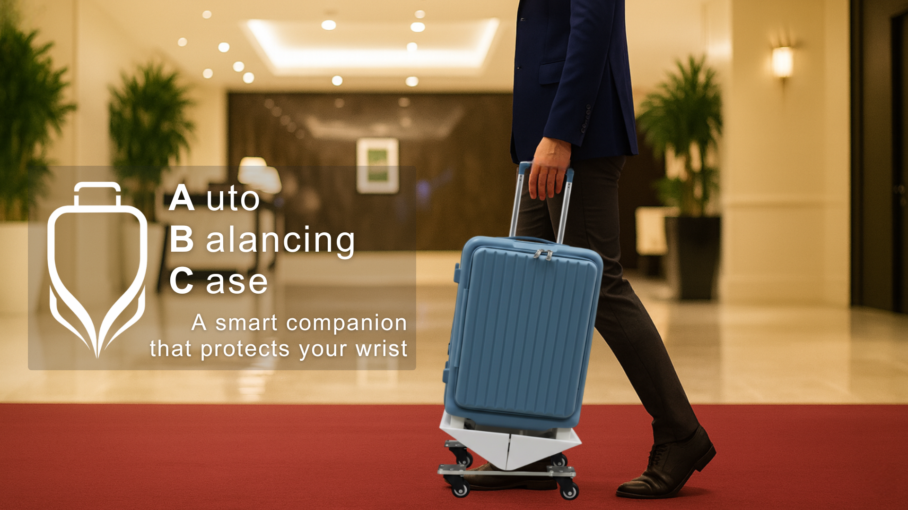
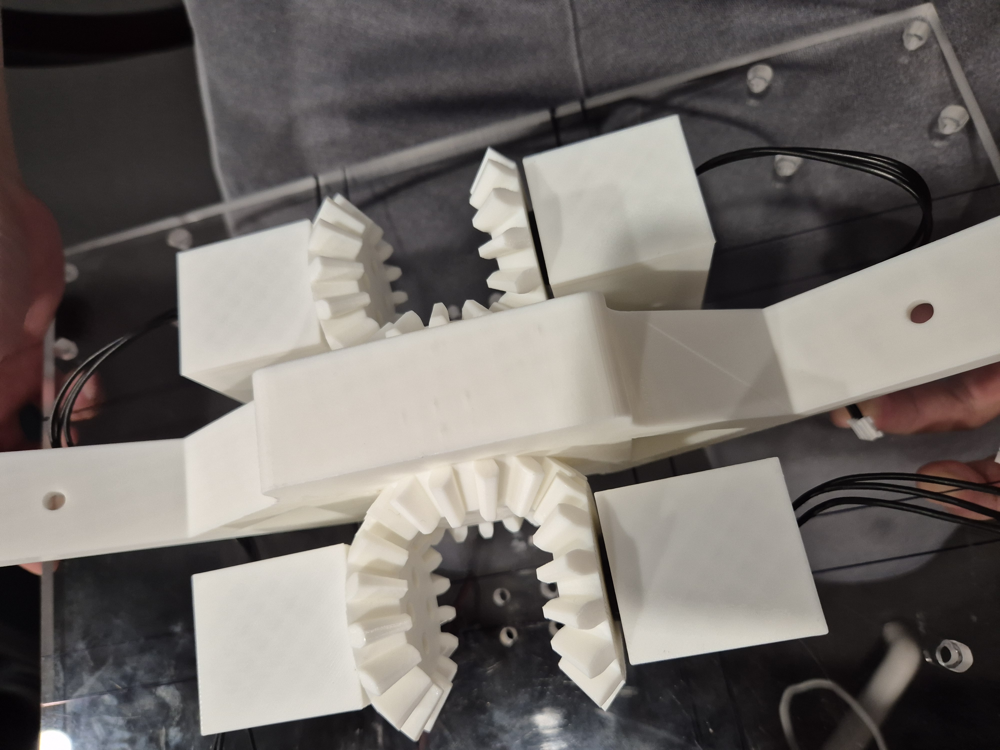
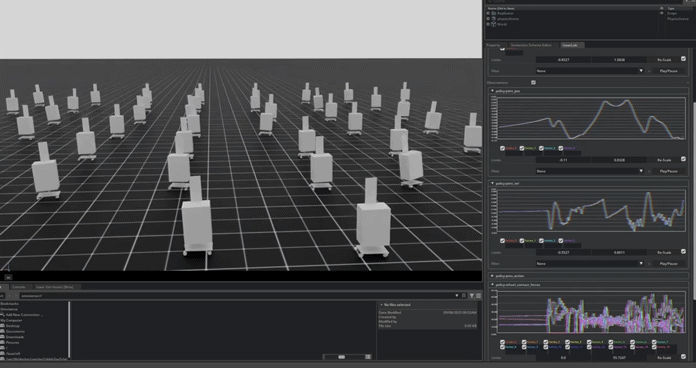
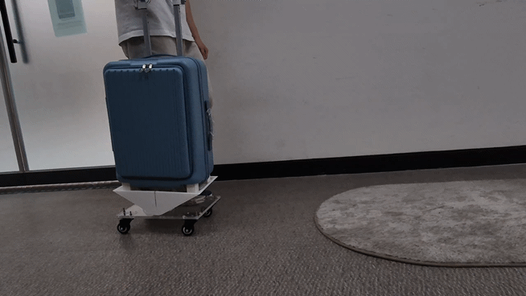

*Team Research Project — Seoul National University, 2024*
*Won Best Award at Material and Manufacturing Process Contest*

## Overview

Conventional wheeled suitcases tilt forward on carpets, ramps, and uneven terrain, forcing users to apply excessive wrist torque. Instead of fighting gravity with powered wheels or complex stabilization, this project takes a different approach: **shifting the suitcase's center of mass** in real time using a learned RL policy.

The suitcase features a mass-shifting upper body connected to the wheeled base via a single revolute joint. A PPO policy trained in NVIDIA Isaac Lab across 2,048 parallel environments commands the upper body to counteract tilting — deployed directly on real hardware at 50 Hz with no fine-tuning required.

## System Architecture

The end-to-end pipeline: CAD design → URDF → Isaac Lab simulation → PPO training → real hardware deployment. The policy observes 32 dimensions (8-dim observation × 4-step history) including joint state, wheel contact forces, and handle force, and outputs a single joint position target.

## Hardware Design

- **Base platform**: 4-wheel mobile base (~0.98 kg, 36 cm × 23 cm)
- **Luggage body**: ~5.6 kg connected via single revolute joint (Y-axis, ±30°)
- **Actuation**: 4× Dynamixel XL430-W250 (Protocol 2.0)
- **Sensing**: 5× HX711 load cells (4 wheel + 1 handle), Arduino Mega at 10 Hz

## Real-Time Control

The 50 Hz control loop executes in a 20 ms budget: read motor state → read sensor state → construct observation → update 4-step history → policy inference (~1 ms) → clip and send motor command. Safety systems include an emergency stop at 0.51 rad tilt and a watchdog timeout.

## Demo

<table width="100%">
<tr>
<td width="50%" align="center"><strong>Simulation (Isaac Lab)</strong> 

</td>
<td width="50%" align="center"><strong>Real Hardware</strong> 

</td>
</tr>
</table>

## Results

- **Zero additional wrist torque** — users reported no extra effort needed on rough terrain
- **20 ms response time** — reacts to pushes and slope changes within one control cycle
- **Direct sim-to-real transfer** — no fine-tuning or adaptation on real hardware
- **Domain randomization**: velocity pushes, external wrenches, mass variation, and observation noise for robust transfer

## Contributors

| Name | Contributions |
|------|--------------|
| **@erickun0125** | Isaac Lab environment, Sim2Real bridge, RL agent training |
| **@toddjrdl** | CAD model design, hardware integration, policy deployment |
| **@juninjae** | Actuator & sensor system, system integration, real-world deployment |
