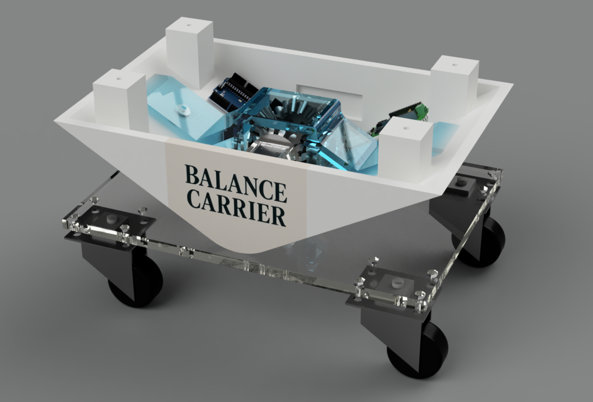
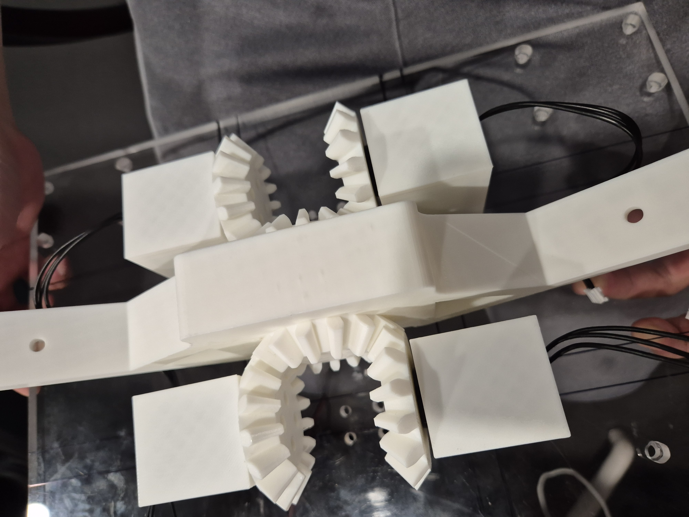
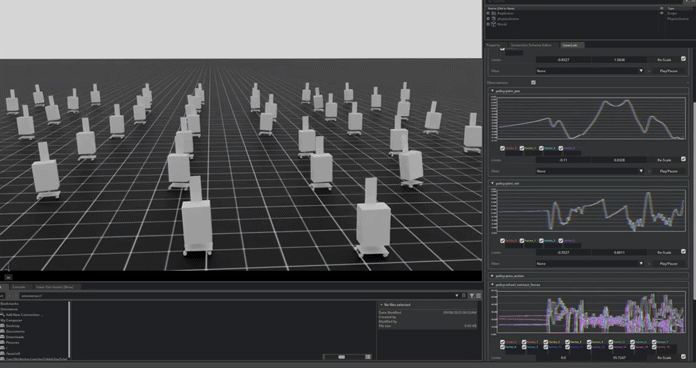
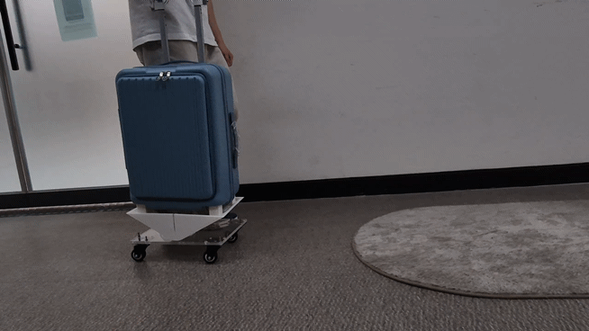

Team project · Seoul National University · 2024

A self-balancing suitcase designed to reduce the effort of handling a tipping case on ramps or uneven surfaces. A PPO policy shifts the upper body's center of mass to counteract tipping, using a controller trained in Isaac Lab and transferred to physical hardware.

## Approach

A movable upper body connects to a four-wheel base through a single actuated hinge joint. The policy uses joint position and velocity, wheel-contact forces, handle force, and action history to command the hinge position. Training runs across 2,048 parallel Isaac Lab environments with randomized external disturbances and observation noise.

  <figure><figcaption>Mechanical design with a movable upper body.</figcaption></figure>
  <figure><figcaption>Fabricated hardware and sensing system.</figcaption></figure>

## Simulation to Hardware

A Python sim-to-real bridge reads the hardware sensors, constructs the policy observations, and sends position commands to the actuators at 50 Hz. The demonstrations below show balancing in Isaac Sim and on the physical suitcase.

  <figure><figcaption>Simulation.</figcaption></figure>
  <figure><figcaption>Real hardware.</figcaption></figure>

<!-- Add the presentation poster here when provided. slide0.png is retained as a source asset and is not labeled as a poster. -->

## Contributions

My contribution covered the Isaac Lab environment, reinforcement learning policy training, and sim-to-real bridge. This was a team project with toddjrdl (CAD design, hardware integration, and deployment) and juninjae (actuator and sensing systems, integration, and deployment).

[Back to Featured Projects](/#projects)
