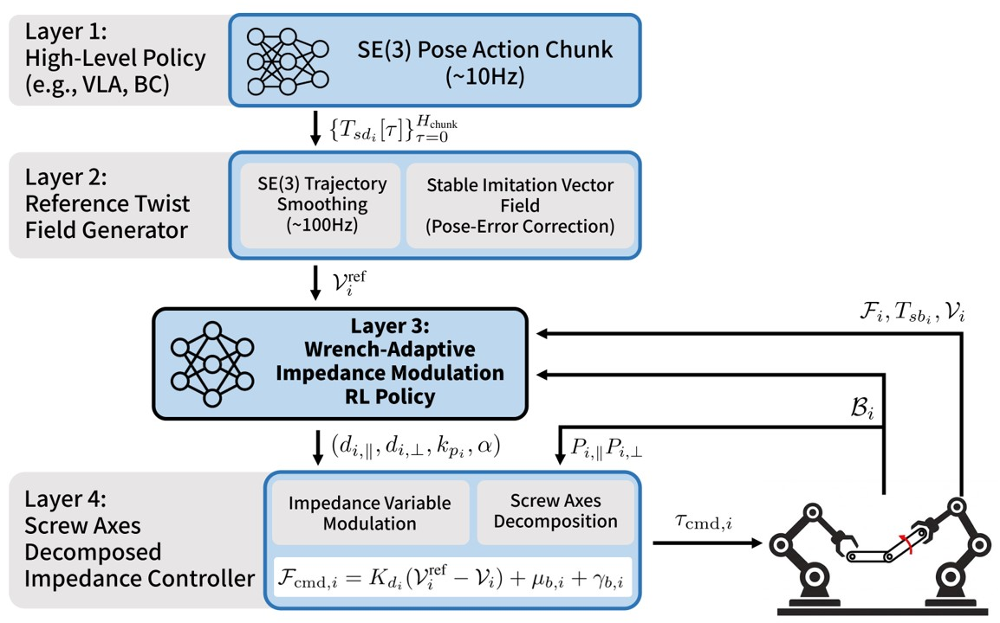
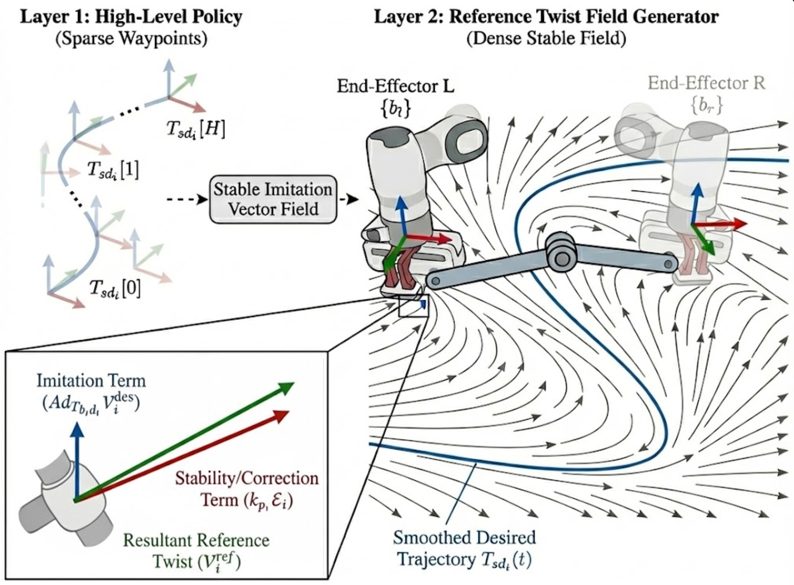
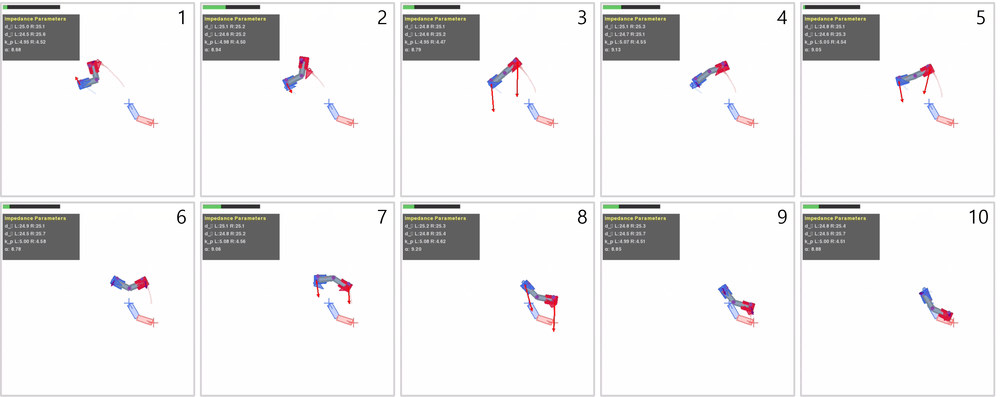

*ME Bachelor's Thesis Project — Robotics Lab, SNU (Prof. Frank C. Park), Jul–Dec 2025*

## Overview

Bimanual manipulation of articulated objects requires simultaneous satisfaction of kinematic constraints and regulation of inter-arm contact forces. Current imitation-based approaches lack adaptive force modulation, relying on high-stiffness position control that generates dangerous fighting forces between arms.

SWIVL addresses this by bridging cognitive planning with physical execution through a four-layer hierarchy. A high-level imitation policy generates sparse SE(3) waypoints, which are smoothed into dense twist fields and executed by a screw-decomposed impedance controller whose parameters are adaptively modulated by an RL policy conditioned on real-time wrench feedback.

## Motivation: Cognitive vs. Physical Intelligence

We distinguish between two complementary aspects of robot decision-making:

- **Cognitive Intelligence** addresses high-level task understanding through semantic reasoning and planning. Modern VLA-based robot foundation models excel at interpreting goals via visual-language understanding, but language lacks the resolution needed for precise physical interaction such as force modulation or coordinated compliance control.

- **Physical Intelligence** ensures safe and stable execution through explicit modeling of dynamics and kinematic principles — regulating contact forces, satisfying geometric constraints, and generating dynamically consistent motions.

Most existing work advances Cognitive Intelligence through robot foundation models trained on cross-embodiment datasets. However, this introduces three limitations for contact-rich manipulation: (1) cross-embodiment training cannot standardize low-level physical signals, (2) imitation learning reproduces trajectories without exploring contact dynamics, and (3) policies output poses executed via high-stiffness control generating excessive forces. These limitations compound in bimanual articulated object manipulation, where force coupling and closed-chain constraints demand physical reasoning beyond current cognitive approaches.

## Problem Setup

We address **bimanual manipulation of articulated objects** where two robot arms cooperatively manipulate a shared object with $k$ internal degrees of freedom. Let $T\_{sb\_l}, T\_{sb\_r} \in \mathrm{SE}(3)$ denote the end-effector poses and ${}^s\mathcal{V}\_{b\_l}, {}^s\mathcal{V}\_{b\_r} \in \mathbb{R}^6$ denote the end-effector twists in the space frame.

**Holonomic Constraint.** Since both end-effectors rigidly grasp the object, their relative motion is constrained to match the motion generated by the object's internal joints:

$${}^s\mathcal{V}_{b_l} - {}^s\mathcal{V}_{b_r} = \mathbf{J}_s(\mathbf{q}_{\text{obj}}) \dot{\mathbf{q}}_{\text{obj}}$$

The fundamental geometric constraint resides in the configuration space $\mathrm{SE}(3)$, governed by the Product of Exponentials formula:

$$T_{sb_l}^{-1} T_{sb_r} = \left( \prod_{i=1}^{k} e^{[\mathcal{S}_i] q_i} \right) M_{\text{obj}}$$

This nonlinear constraint in the SE(3) manifold motivates transforming pose commands into twist-space representations where constraints become linear.

**Key Challenges:**

1. **From Discrete Poses to Dense Twist References (C1):** Modern policies output sparse action chunks with a pose space vs. twist space mismatch — kinematic constraints are linear in $\mathfrak{se}(3)$ but nonlinear in $\mathrm{SE}(3)$.
2. **Compliant Constraint Satisfaction (C2):** Hard constraint enforcement is brittle — any small error in the Jacobian directly translates to physically infeasible commands and large fighting forces.
3. **SE(3) Impedance Complexity (C3):** Impedance control on SE(3) involves a nonlinear Jacobian $J\_{\mathcal{E}}$ that couples rotation and translation in configuration-dependent ways.
4. **Bulk Motion Ambiguity (C4):** Bulk motion components of the two arms do not match when planners generate kinematically inconsistent commands, manifesting as inter-arm force coupling.

## Architecture

SWIVL decomposes the bimanual manipulation problem into four layers, translating high-level planning at 10 Hz into impedance-controlled execution at 100 Hz.

- **Layer 1 — High-Level Policy** (VLA / ACT / Diffusion / Flow Matching): Generates sparse SE(3) pose action chunks from visual observations at ~10 Hz
- **Layer 2 — Reference Twist Field Generator**: Transforms sparse waypoints into dense, closed-loop reference twists $\mathcal{V}\_i^{\text{ref}}$ with stability guarantees (**C1**)
- **Layer 3 — Impedance Variable Modulation Policy** (PPO + FiLM): RL policy $\pi\_\theta$ that modulates impedance variables based on object geometry and wrench feedback (**C3, C4**)
- **Layer 4 — Screw-Decomposed Impedance Controller**: Executes compliant control with independent regulation of bulk and internal motions (**C2, C3**)

## Layer 2: Stable Imitation Vector Field

A key challenge is converting sparse pose waypoints into dense, stable reference twists. The Reference Twist Field Generator performs three steps:

**Step 1 — SE(3) Trajectory Smoothing:** Smooth interpolation via SLERP (rotations) and cubic splines (translations) produces dense desired trajectories at the control frequency.

**Step 2 — Body Twist Computation:** For each interpolated trajectory, the desired body twist is computed by differentiation:

$$\mathcal{V}_i^{\text{des}}(t) = \begin{bmatrix} \omega_i^{\text{des}}(t) \\\\ v_i^{\text{des}}(t) \end{bmatrix}, \quad [\omega_i^{\text{des}}]_\times = R_{sd_i}^\top \dot{R}_{sd_i}, \quad v_i^{\text{des}} = R_{sd_i}^\top \dot{p}_{sd_i}$$

**Step 3 — Stable Imitation Vector Field:** A vector field balancing **imitation** of demonstrated motions and **stability** for error correction:

$$\mathcal{V}_i^{\text{ref}}(t, T_{sb_i}) = \mathrm{Ad}_{T_{b_i d_i}} \mathcal{V}_i^{\text{des}}(t) + k_{p_i} \mathcal{E}_i$$

where the pose error term is:

$$\mathcal{E}_i = \begin{pmatrix} \alpha \, e_{R_i} \\\\ e_{p_i} \end{pmatrix}, \quad e_{R_i} = \log(R_{sb_i}^\top R_{sd_i})^\vee, \quad e_{p_i} = R_{sb_i}^\top(p_{sd_i} - p_{sb_i})$$

**Metric Tensor.** The characteristic length $\alpha$ defines a metric tensor $G = \mathrm{diag}(\alpha^2 I\_3, I\_3)$ inducing an inner product on $\mathfrak{se}(3)$:

$$\langle \mathcal{V}_1, \mathcal{V}_2 \rangle_G = \frac{\alpha^2}{2} \mathrm{tr}([\omega_1]^\top [\omega_2]) + v_1^\top v_2$$

This metric induces a left-invariant Riemannian metric on SE(3) whose geodesics correspond to free-body motion — providing a dynamically consistent notion of distance on the manifold.

**Dual Role of $k\_p \mathcal{E}$:** The stability term serves a crucial dual purpose: it provides corrective feedback for trajectory tracking *and* acts as an elastic force term in the impedance framework, **bypassing the problematic SE(3) Jacobian $J\_{\mathcal{E}}$**.

## Layer 4: Screw-Decomposed Impedance Control

Rather than enforcing hard kinematic constraints, SWIVL adopts a **compliant approach** through impedance control, decomposing the twist space into object-centric subspaces.

### Motion Space Decomposition

Motions decompose into:
- **Internal motion** $\mathcal{V}\_\parallel \in \text{range}(J\_i)$: drives joint articulation
- **Bulk motion** $\mathcal{V}\_\perp$: drives the object's overall motion through space

Using the metric tensor $G$, $G$-orthogonal projection operators are constructed:

$$P_{i,\parallel} = J_i (J_i^\top G J_i)^{-1} J_i^\top G, \quad P_{i,\perp} = I - P_{i,\parallel}$$

These satisfy $G$-self-adjointness, orthogonality ($P\_{i,\parallel} P\_{i,\perp} = 0$), and partition of identity. Since $\alpha$ is learned by the policy, the metric tensor and projection operators **adapt dynamically** to task requirements.

### Controller Formulation

The damping matrix respects the motion decomposition:

$$K_{d_i} = G(P_{i,\parallel} \, d_{i,\parallel} + P_{i,\perp} \, d_{i,\perp})$$

The commanded wrench becomes:

$$\mathcal{F}_{\mathrm{cmd}, i} = K_{d_i}(\mathcal{V}_i^{\text{ref}} - \mathcal{V}_i) + \mu_{b,i} + \gamma_{b,i}$$

which expands to:

$$\mathcal{F}_{\mathrm{cmd}, i} = \underbrace{d_{i,\parallel} \, G(\mathcal{V}_{i,\parallel}^{\text{ref}} - \mathcal{V}_{i,\parallel})}_{\text{internal motion control}} + \underbrace{d_{i,\perp} \, G(\mathcal{V}_{i,\perp}^{\text{ref}} - \mathcal{V}_{i,\perp})}_{\text{bulk motion control}} + \mu_{b,i} + \gamma_{b,i}$$

This decomposition provides two critical properties: **independent compliance modulation** (the policy can independently adjust $d\_{i,\parallel}$ and $d\_{i,\perp}$ for task-specific behavior) and **decoupled power generation** (feedback wrenches for internal and bulk motions are reciprocally orthogonal to opposing motion subspaces).

### Dual Interpretation

The controller admits two complementary interpretations:

1. **Twist-Driven SE(3) Impedance:** Our approach sidesteps the explicit nonlinear Jacobian $J\_{\mathcal{E}}$ by incorporating pose error directly into the reference twist, achieving geometrically consistent impedance behavior without linearization errors.

2. **Task-Semantic Motion Decomposition:** Independent control of internal (joint articulation) and bulk (object transport) motions enables implicit constraint satisfaction — a capability intractable to design analytically.

## Layer 3: Wrench-Adaptive Impedance Learning

The RL policy $\pi\_\theta$ modulates impedance variables to enable physically feasible motions while accounting for object constraints and inter-arm force interactions.

### Observation and Action Spaces

**Observation** ($\mathbb{R}^{30}$): reference twists $\lbrace\mathcal{V}\_l^{\text{ref}}, \mathcal{V}\_r^{\text{ref}}\rbrace$, body screw axes $\lbrace\mathcal{B}\_l, \mathcal{B}\_r\rbrace$, wrench feedback $\lbrace\mathcal{F}\_l, \mathcal{F}\_r\rbrace$, and proprioception $\lbrace T\_{sb\_l}, T\_{sb\_r}, \mathcal{V}\_l, \mathcal{V}\_r\rbrace$.

**Action** ($\mathbb{R}^7$): impedance variables $(d\_{l,\parallel}, d\_{r,\parallel}, d\_{l,\perp}, d\_{r,\perp}, k\_{p\_l}, k\_{p\_r}, \alpha)$ — independent damping for internal/bulk motions, stiffness gains, and learnable characteristic length.

### Wrench Decomposition

Measured wrenches decompose into internal and bulk components via twist-wrench duality:

$$\mathcal{F}_{i,\parallel} = P_{i,\parallel}^\top \mathcal{F}_i \quad \text{(internal)}, \qquad \mathcal{F}_{i,\perp} = P_{i,\perp}^\top \mathcal{F}_i \quad \text{(bulk / fighting force)}$$

The bulk component $\mathcal{F}\_{i,\perp}$ represents **fighting forces** that do not contribute to joint motion, arise from coordination errors, and may cause grasp instability and hardware damage. Minimizing $\lVert\mathcal{F}\_{i,\perp}\rVert^2$ implicitly resolves the bulk motion ambiguity.

### Reward Design

The reward balances four objectives: $r\_t = r\_{\text{track}} + r\_{\text{safety}} + r\_{\text{reg}} + r\_{\text{term}}$

- **Motion Tracking:** $r\_{\text{track}} = -w\_{\text{track}} \sum\_i \lVert\mathcal{V}\_i - \mathcal{V}\_i^{\text{ref}}\rVert\_G^2$
- **Safe Inter-arm Force Interaction:** $r\_{\text{safety}} = w\_{\text{safety}} \exp\bigl(-\kappa \sum\_i \lVert\mathcal{F}\_{i,\perp}\rVert\_{G^{-1}}^2\bigr)$ — exponential form provides a positive alive bonus when fighting forces are low, preventing early termination pathology
- **Motion Smoothness:** $r\_{\text{reg}} = -w\_{\text{reg}} \sum\_i \lVert\dot{\mathcal{V}}\_i\rVert^2$
- **Termination Penalty:** Applied on grasp drift or wrench limit violations

### Policy Architecture

The policy uses a multi-stream architecture with **Feature-wise Linear Modulation (FiLM)** to inject object geometry into feature processing. Separate encoders process reference twists, wrenches, and proprioception, with FiLM layers modulating features based on screw axes $\lbrace\mathcal{B}\_l, \mathcal{B}\_r\rbrace$, enabling dynamic adaptation across joint types. Training uses **PPO** with GAE for advantage estimation.

## Results — BiarT Benchmark

SWIVL is evaluated on **BiarT** (Bimanual Articulated manipulation), a Pymunk-based SE(2) simulation environment for bimanual manipulation of articulated objects — analogous to how PushT serves as a minimal benchmark for single-arm planar manipulation. The environment features a 512×512 pixel planar workspace with dual 3-DoF end-effectors under direct body wrench control, with 3-axis F/T sensing per end-effector.

All methods share the same **Flow Matching Policy** as the high-level planner, isolating the contribution of the low-level control strategy.

| Method | Revolute | Prismatic | Avg. Success | Wrench Fail | Grasp Fail |
|:-------|:--------:|:---------:|:------------:|:-----------:|:----------:|
| Position Control | 10% | 30% | 20% | 55% | 0% |
| Impedance Control | 10% | 60% | 35% | 10% | 25% |
| **SWIVL (Ours)** | **40%** | **80%** | **60%** | **0%** | **5%** |

### Analysis

**Position Control fails** because high-stiffness tracking of kinematically inconsistent references directly translates to excessive fighting forces (55% wrench failures), particularly for revolute joints (70%) where rotational constraints amplify force coupling.

**Classical Impedance Control is insufficient** — isotropic compliance reduces peak forces but introduces uncontrolled motion causing the *highest* grasp drift failures (25%). It also suffers from linearization errors ($J\_l^{-1}(e\_R) \approx I\_3$ breaks down) and cannot distinguish motion along vs. orthogonal to constraints.

**SWIVL achieves 3× higher success rate** over position control while **completely eliminating wrench limit violations**. Its 5% grasp drift (vs. 25% for impedance control) demonstrates that screw-decomposed control selectively applies compliance along constraint directions while maintaining stability orthogonal to them.

**SWIVL's higher timeout rate** (35%) reflects a deliberate trade-off: by prioritizing safety through learned compliance, the policy is occasionally more conservative — a "safe but slow" behavior preferable in real-world deployment.

## Inference

The full pipeline in action: two end-effectors cooperatively manipulate an articulated object while the RL policy adaptively modulates impedance parameters in real time. The impedance parameters panel displays learned values — damping coefficients $d\_\parallel, d\_\perp$ for internal and bulk motions, stiffness $k\_p$, and characteristic length $\alpha$. Red arrows indicate wrench feedback from F/T sensors.

## Key Contributions

1. **Twist-Driven SE(3) Impedance Control via Stable Imitation Vector Fields:** Bypass the nonlinear pose-error Jacobian inherent in SE(3) impedance control by incorporating pose errors directly into reference twists, enabling geometrically consistent compliance even under large trajectory deviations.

2. **Screw Axes-Decomposed Twist and Wrench Spaces:** Orthogonal projection operators structurally partition control into internal (joint articulation) and bulk (object transport) components, enabling independent compliant behavior for each object-kinematics-aware subspace.

3. **Wrench-Adaptive Impedance Variable Learning:** An RL policy modulates impedance parameters conditioned on object screw axes and real-time wrench feedback, learning to suppress harmful fighting forces while maintaining compliant trajectory tracking across diverse joint types.
