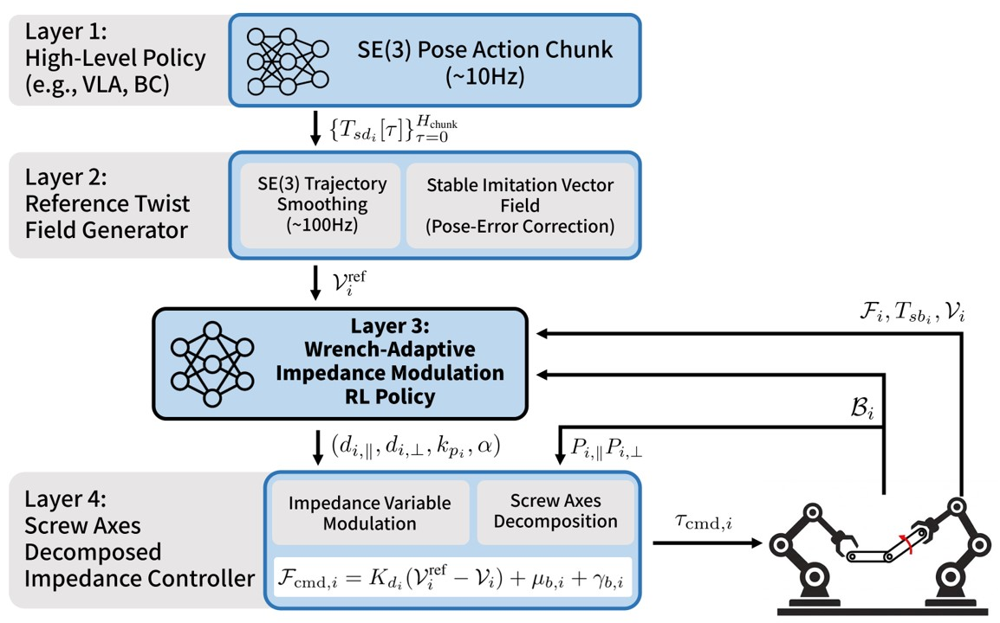
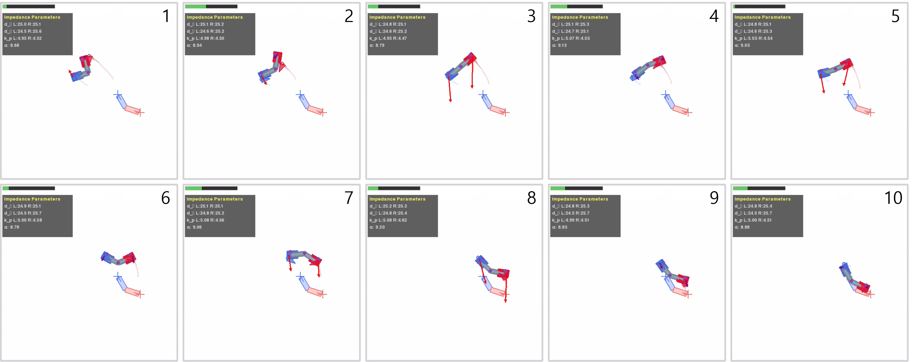
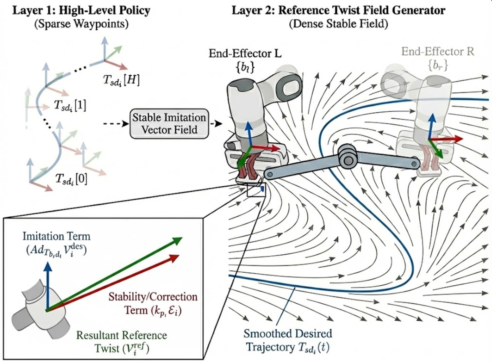

Screw-Wrench Informed Impedance Variable Learning Robotics Lab, Seoul National University · Prof. Frank C. Park · Jul 2025 - Dec 2025

SWIVL connects high-level motion plans to adaptive impedance control for two arms manipulating an articulated object. It uses the object's screw axes and measured wrench feedback to learn how compliance should change during coordinated motion.

## Approach

The four-layer hierarchy starts with sparse SE(3) waypoints from a learned high-level policy. A reference twist field turns these waypoints into continuous motion commands with pose-error correction. A PPO policy conditioned on object screw axes and wrench feedback then modulates the impedance parameters of the low-level controller.

  <figure><figcaption>From high-level waypoints to adaptive impedance control.</figcaption></figure>
  <figure><figcaption>Bimanual manipulation of an articulated object.</figcaption></figure>

## Motion and Force Coordination

Screw decomposition separates **internal motion**, which articulates the object's joint, from **bulk motion**, which transports the object. The controller regulates compliance in these two subspaces independently, helping the arms follow motion references while limiting harmful opposing forces.

## Evaluation

The framework was evaluated in **BiarT**, a planar SE(2) simulation benchmark with two 3-DoF end-effectors and articulated objects with revolute or prismatic joints. The experiments compare learned impedance modulation with position control and classical impedance control, examining both task success and wrench-limit violations.

<!-- Add the presentation poster here when provided. Keep the existing overview and demonstration assets as separate figures. -->

[Back to Featured Projects](/#projects)
