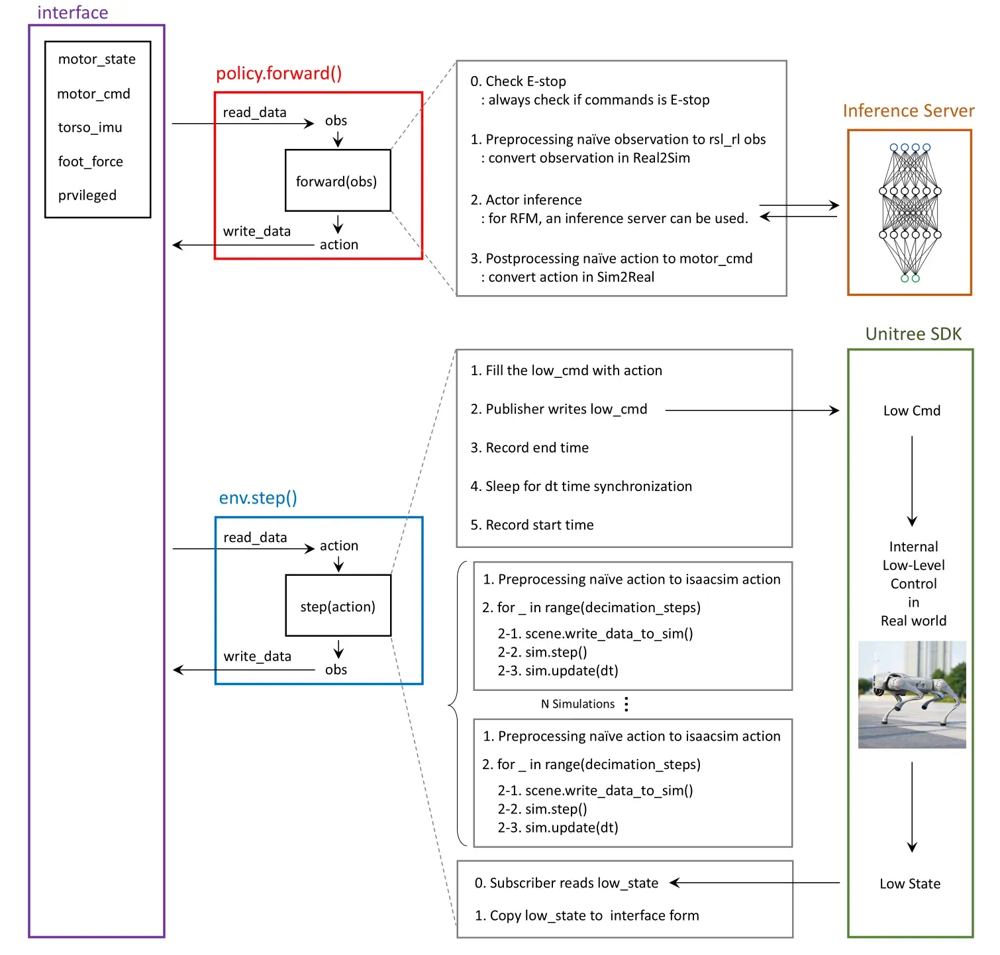

*AI Robot Dynamics Engineer Intern — Sequor Robotics, Jun–Oct 2025*

## Overview

This project develops custom RL environments and a complete sim-to-real pipeline for two Unitree robots: the **GO2 quadruped** (12 DOF) and the **G1 humanoid** (29 DOF), built on NVIDIA Isaac Lab. The GO2 policies were developed as demonstration RL policies for Sequor Robotics' deployment pipeline, while the G1 work extends to bipedal loco-manipulation and whole-body control.

The RL environments and methodologies presented here represent the publicly shareable portion of the internship work. The proprietary sim-to-real deployment pipeline remains confidential, but the overall architecture I designed is shared below.

## Demo

### GO2 Recovery Task

<table width="100%">
<tr>
<td width="50%" align="center"><strong>Simulation</strong> 
<video autoplay loop muted playsinline style="width:100%;max-width:480px">
  <source src="recovery_sim.mp4" type="video/mp4">
</video></td>
<td width="50%" align="center"><strong>Real Robot</strong> 
<video autoplay loop muted playsinline style="width:100%;max-width:480px">
  <source src="recovery_real.mp4" type="video/mp4">
</video></td>
</tr>
</table>

### GO2 Velocity Tracking Task

<table width="100%">
<tr>
<td width="50%" align="center"><strong>Simulation</strong> 
<video autoplay loop muted playsinline style="width:100%;max-width:480px">
  <source src="velocity_sim.mp4" type="video/mp4">
</video></td>
<td width="50%" align="center"><strong>Real Robot</strong> 
<video autoplay loop muted playsinline style="width:100%;max-width:480px">
  <source src="velocity_real.mp4" type="video/mp4">
</video></td>
</tr>
</table>

## Sim-to-Real Architecture

The key idea is a unified **interface abstraction** that allows the same policy to run in both simulation and on the real robot. Real2Sim/Sim2Real observation and action conversions are handled transparently:

- **`policy.forward()`** (deployment): Reads sensor data, converts observations from Real2Sim format, runs actor inference, and converts actions to motor commands
- **`env.step()`** (training): Runs N parallel physics simulations with decimation steps, matching the real-world control frequency

## Key Technical Contributions

- **Symmetry-Aware Data Augmentation** — Mirrors observations and actions along the sagittal plane, effectively doubling training data per step. Accelerates convergence by 30–50% across all locomotion tasks.
- **Two-Level Curriculum Learning** — Combines command range expansion with adaptive reward weight scheduling. Regularization rewards start high for stability, then decrease as task rewards increase.
- **Hybrid Control Architecture (G1)** — Decomposes the 29-DOF humanoid: RL for lower body locomotion (12 DOF), IK/IL for upper body manipulation (14 DOF + hands). Reduces effective RL action space by ~60%.
- **Physics-Based Fall Recovery (GO2)** — Trains on physically realistic fallen poses from simulated falls, with multi-phase reward: limb retraction → body rotation → push-up to standing.

## Results

| Metric | Value |
|:-------|:------|
| Recovery Task Success Rate | 95%+ within 5 seconds |
| Velocity Tracking Error | < 0.1 m/s average |
| Sim-to-Real Performance Retention | > 90% |
| Deployment Environments | Various indoor/outdoor terrains |
| Hardware | Unitree Go2 Edu via Sequor Sim2Real Pipeline |
