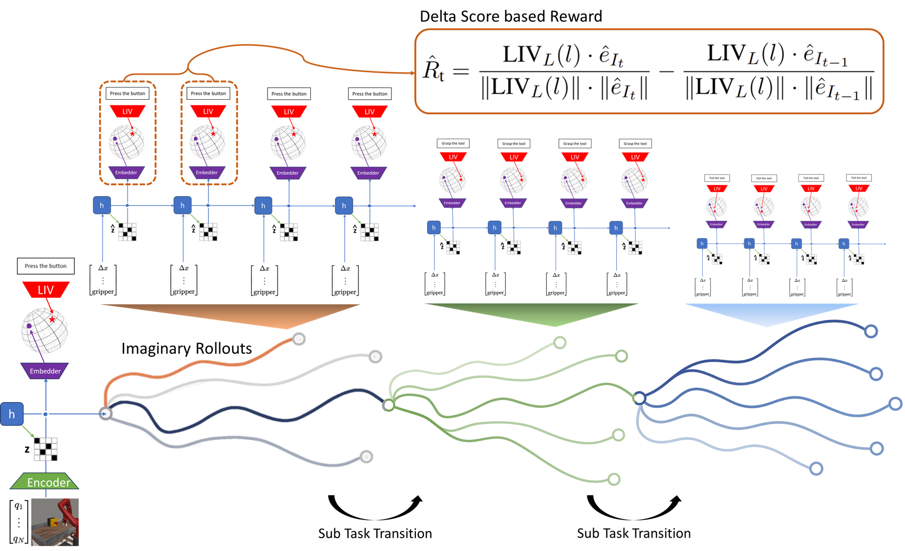
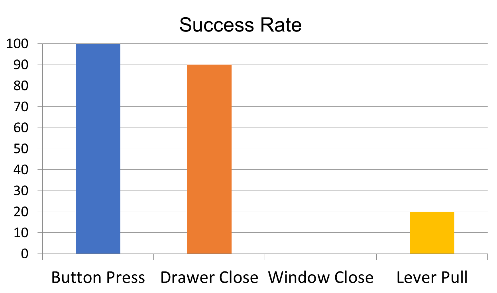
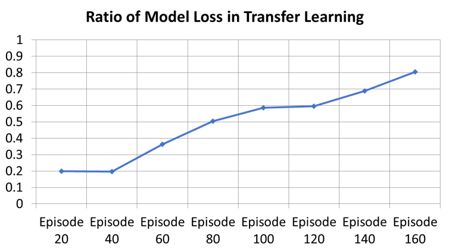
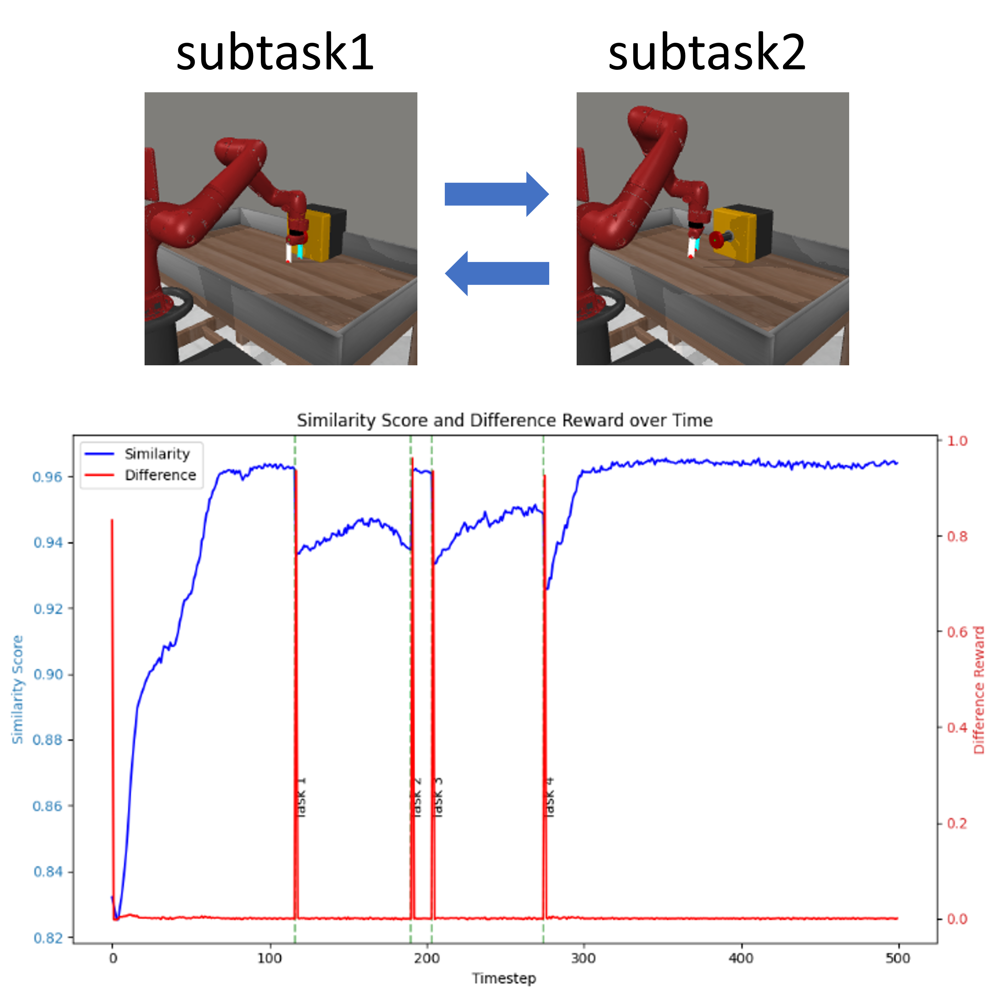
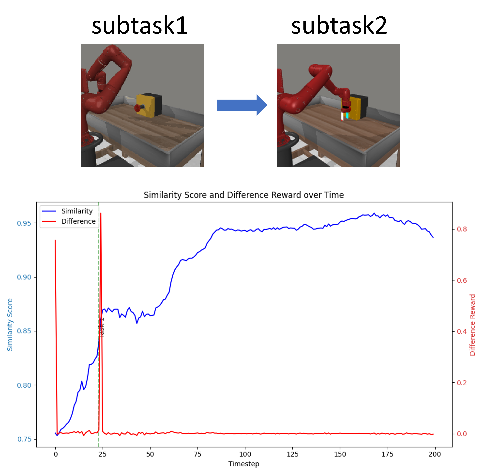
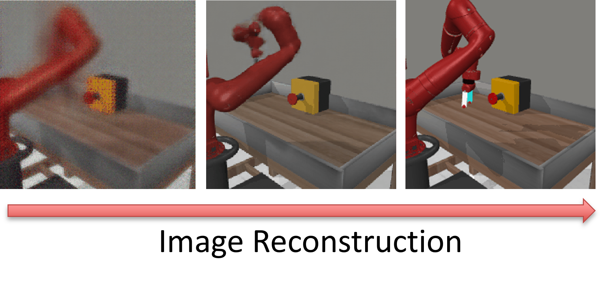

*ECE Bachelor's Thesis Project — CORE Lab, SNU (Prof. Insoon Yang), Jan–Jun 2025*

## Overview

Most Robot Foundation Models (RFMs) today rely on imitation learning frameworks like behavior cloning, where policies are learned directly from expert demonstrations. While models such as OpenVLA, PI0, and GR00T-N1 have shown impressive results, they lack explicit control/planning components, making it difficult to perform goal-directed behavior under varying task objectives and physical constraints in long-horizon scenarios.

**LIVerse** (**L**anguage & **I**mage integrated uni**Verse** model) is a novel World Foundation Model (WFM) that addresses these limitations by unifying vision-language semantics and forward dynamics into a single latent space. Built on a DreamerV3-style Recurrent State Space Model (RSSM), LIVerse replaces the traditional reward predictor with a **Language-Image Embedder** that predicts semantic embedding vectors from the pretrained VLM encoder [LIV](https://arxiv.org/abs/2306.00958). This design enables model-based reinforcement learning agents that are **embodiment-dependent but task-agnostic** — the same world model can be reused across different tasks by simply changing the target embedding.

Unlike traditional VLM-RM based RL approaches where VLM rewards serve only as auxiliary signals for single-task optimization, LIVerse-based MPC directly converts a zero-shot reward model into a **zero-shot policy**, requiring no task-specific training.

## Motivation: Limitations of Cosine Similarity Rewards

CLIP-style reward models compute rewards as the cosine similarity between an image observation embedding and a target text/image embedding. Under simple dynamics where embeddings lie on a unit sphere, we can show that the optimal policy always takes the largest possible step directly toward the goal embedding:

$$\textbf{Reward:} \quad r(x) = \frac{x^\top x^*}{\|x\| \, \|x^*\|}$$

$$\textbf{Dynamics:} \quad x_{t+1} = \frac{x_t + a}{\|x_t + a\|} \quad (\|x_t\| = 1)$$

$$\textbf{Optimal Policy:} \quad \pi^*(x) = \lambda(x^* - x)$$

This induces fixed-point tracking behavior, which becomes problematic as trajectory non-linearity increases in complex tasks. The optimal trajectory in embedding space does not map to the optimal trajectory in task space, causing agents to get stuck in local optima when tasks require curved or multi-step paths.

## LIVerse Architecture

### Recurrent State Space Model (RSSM)

The RSSM captures the agent's latent forward dynamics via GRU-based recurrent units:

**Encoder** — Encodes observations (image frame $I_t$ and robot state $q_t$) into stochastic latent variables:
$$z_t \sim q_\phi(z_t \mid h_t, I_t, q_t)$$

**Recurrent Dynamics** — Predicts the next recurrent state from previous state, action, and stochastic latent:
$$h_t = f_\phi(h_{t-1}, z_{t-1}, a_{t-1})$$

**Transition Predictor** — Predicts the next stochastic latent using only $h_t$ (without observing $I_t$, $q_t$), modeling forward dynamics independently from observation:
$$\hat{z}_t \sim p_\phi(\hat{z}_t \mid h_t)$$

### Prediction Heads

Instead of predicting scalar rewards directly, LIVerse introduces prediction heads that decode both observations and VLM embedding vectors from the latent state:

**LIV Image Embedder** — Predicts the LIV image embedding $e_{I_t}$ corresponding to the current image frame. This replaces the traditional reward predictor in Dreamer:
$$\hat{e}_{I_t} \sim p_\phi(\hat{e}_{I_t} \mid h_t, z_t)$$

**Image Reconstructor** — Reconstructs image frame $I_t$ to regularize visual feature learning:
$$\hat{I}_t \sim p_\phi(\hat{I}_t \mid h_t, z_t)$$

**Robot State Reconstructor** — Reconstructs robot state $q_t$ for accurate physical dynamics:
$$\hat{q}_t \sim p_\phi(\hat{q}_t \mid h_t, z_t)$$

### Training Objectives

The model is trained with a combined loss:

$$\mathcal{L}(\phi) = \mathbb{E}_{q_\phi} \left[ \sum_{t=1}^{T} \left( \beta_{\text{pred}} \mathcal{L}_{\text{pred}} + \beta_{\text{dyn}} \mathcal{L}_{\text{dyn}} + \beta_{\text{rep}} \mathcal{L}_{\text{rep}} \right) \right]$$

where the **prediction loss** encourages accurate modeling of semantic embeddings:
$$\mathcal{L}_{\text{pred}}(\phi) = - \ln p_\phi(I_t \mid z_t, h_t) - \ln p_\phi(q_t \mid z_t, h_t) - \ln p_\phi(e_{I_t} \mid z_t, h_t)$$

and **representation / dynamics losses** are KL divergences between posterior and prior distributions:
$$\mathcal{L}_{\text{rep}}(\phi) = \max\left(1,\; \text{KL}\left[ q_\phi(z_t \mid h_t, x_t) \;\|\; \text{sg}(p_\phi(z_t \mid h_t)) \right] \right)$$
$$\mathcal{L}_{\text{dyn}}(\phi) = \max\left(1,\; \text{KL}\left[ \text{sg}(q_\phi(z_t \mid h_t, x_t)) \;\|\; p_\phi(z_t \mid h_t) \right] \right)$$

## Model-Based RL Agents with LIVerse

### Actor-Critic Agent (Dreamer-style)

The Dreamer-style agent learns its policy entirely from imaginary rollouts. The reward at each timestep is computed as the cosine similarity between the predicted LIV embedding $\hat{e}_{I_t}$ and the task embedding $e_T$:

$$r_t = \frac{ \hat{e}_{I_t} \cdot e_T }{ \| \hat{e}_{I_t} \| \cdot \| e_T \| }$$

This provides substantial computational efficiency since the LIV encoder is not queried repeatedly during training. However, since each actor-critic agent is still trained for a specific task, the policy remains task-specific.

### Sampling-based MPC Agent (PlaNet-style)

The MPC agent leverages LIVerse both as a **simulator** and a semantics-aware **task interpreter**. At test time, the Cross-Entropy Method (CEM) optimizes action sequences by rolling out candidate trajectories through the learned world model and selecting those that maximize similarity to the goal embedding over the planning horizon.

This approach requires **no training for policy** — task objectives can be changed at runtime by simply providing a new goal embedding (text or image). As a result, a VLM-based zero-shot reward model directly transfers to a **zero-shot policy**.

## Delta-Score Reward for Step-wise Planning

### The Problem

Cosine similarity rewards behave as fixed-point tracking, which fails when complex tasks require curved or multi-step trajectories. Step-wise planning decomposes tasks into subtasks to increase the linearity of each sub-trajectory. However, when target embeddings change between subtasks, the reward scale itself shifts — causing agents to avoid transitioning to the next subtask (local minima).

### The Solution

We propose a **delta-score reward** that measures the *incremental improvement in similarity* rather than absolute similarity:

$$r_t = \Delta\text{Score}_t = \frac{\text{LIV}_L(l) \cdot \hat{e}_{I_t}}{\|\text{LIV}_L(l)\| \cdot \|\hat{e}_{I_t}\|} - \frac{\text{LIV}_L(l) \cdot \hat{e}_{I_{t-1}}}{\|\text{LIV}_L(l)\| \cdot \|\hat{e}_{I_{t-1}}\|}$$

This formulation naturally supports step-wise planning: each sub-task is rewarded based on its own incremental progress, and the system can incorporate a high-level hierarchical planner that sequences sub-tasks through texts, images, or latent representations. The approach is also modality-agnostic — target embeddings can come from text descriptions, real images, or even AI-generated goal images.

## Key Contributions

- **World Foundation Model** — Unifies vision-language semantics (LIV/CLIP) with forward dynamics (RSSM) in a single latent space; embodiment-dependent but task-agnostic
- **Zero-Shot MPC Policy** — Converts the trained world model into a zero-shot policy via CEM, requiring no task-specific training
- **Delta-Score Reward** — Measures incremental similarity improvement to resolve reward scale mismatch across subtasks, escaping local minima during subtask transitions
- **Step-wise Planning** — Adaptive multi-subtask decomposition with automatic goal switching via plateau detection; modality-agnostic (text, image, or mixed)

## Results (Meta-World Benchmark)

Experiments were conducted on Meta-World ML1 tasks (button press, drawer close, window close, lever pull) with 224x224 RGB observations, 39-dim robot state, and 4-dim continuous action space.

### Zero-Shot Policy Execution

Using a task-agnostic LIVerse world model trained only in the button press environment, the MPC agent achieved **100% success rate on button press** and strong performance on drawer close — without any task-specific policy training.

### Transfer Learning

When fine-tuning LIVerse from button press to drawer close, the model loss ratio was significantly lower in early episodes compared to training from scratch, demonstrating **few-shot learning capability** with minimal environment interaction.

### Step-wise Planning with Delta-Score Reward

Three complex task experiments validated the delta-score reward: (1) periodic button press-release, (2) curved trajectory before pressing, and (3) multi-modal subtask sequences mixing different image styles and text descriptions. At each subtask transition, sharp reward scale changes confirm that traditional cosine similarity alone cannot resolve the local minima problem.

  
  

### World Model Image Reconstruction

Visual reconstruction quality progressively improves over training episodes (20, 40, 60), with initial blurry outputs becoming sharper and more accurate, confirming effective latent dynamics learning.

