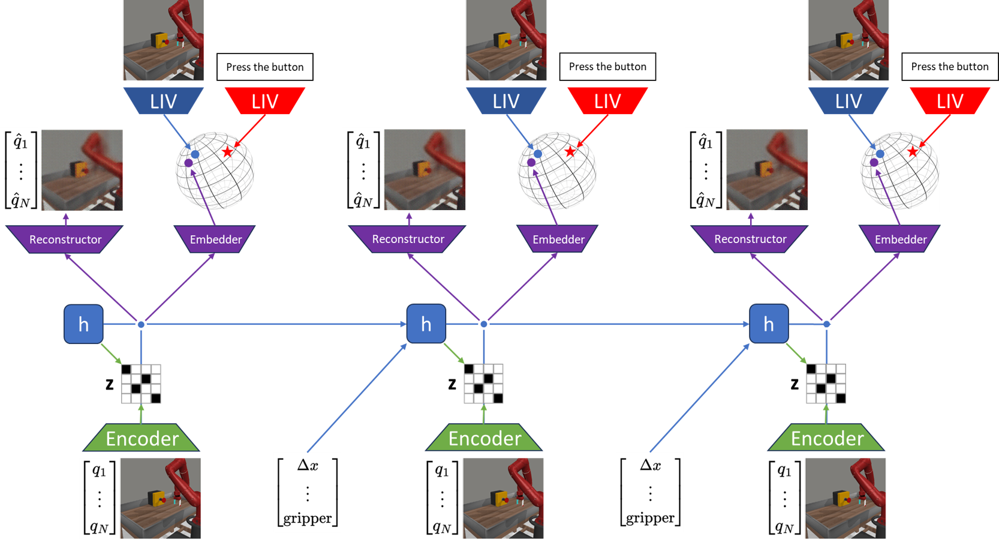
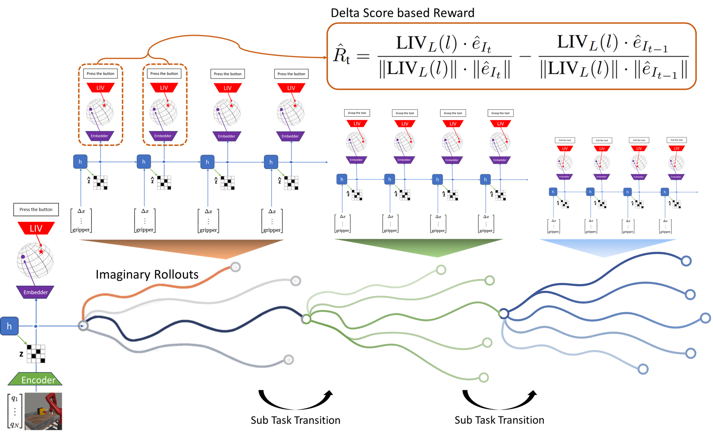
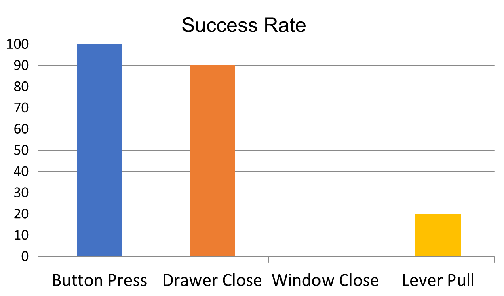
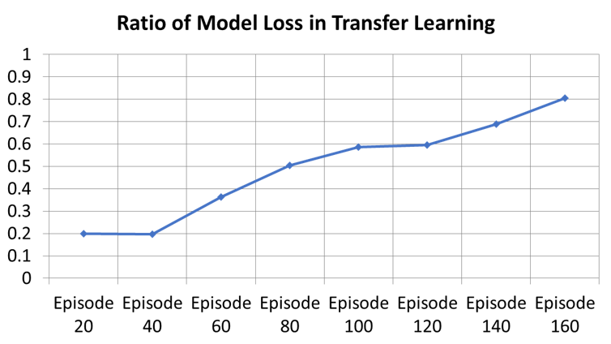

Language & Image integrated uniVerse Model CORE Lab, Seoul National University · Prof. Insoon Yang · Jan 2025 - Jun 2025

LIVerse learns a world model that predicts dynamics and vision-language embeddings, then uses that model to plan toward text or image goals. Changing the target embedding lets the MPC planner reuse the learned model without training a new task-specific policy.

## Approach

Built on a DreamerV3-style recurrent state-space model, LIVerse predicts visual and robot states as well as semantic image embeddings from a pretrained LIV encoder. A CEM-based model predictive controller samples action sequences, imagines their outcomes, and scores them by similarity to the target text or image embedding.

  <figure><figcaption>Latent dynamics with a semantic embedding prediction head.</figcaption></figure>
  <figure><figcaption>Goal-conditioned planning in the learned world model.</figcaption></figure>

## Planning Across Subtasks

The **delta-score reward** measures incremental improvement in goal similarity rather than its absolute value. This gives the planner a progress signal across subtasks with different similarity baselines. A step-wise planning mode switches between goal embeddings as progress plateaus, supporting sequential objectives with the same world model.

## Demonstrations & Results

Experiments use Meta-World manipulation tasks, including button pressing, drawer closing, window closing, and lever pulling. The figures below show zero-shot MPC planning with a trained world model and transfer experiments. The project also includes a Dreamer-style actor-critic agent for comparison.

  <figure><figcaption>Zero-shot planning experiments.</figcaption></figure>
  <figure><figcaption>Transfer experiments.</figcaption></figure>

<!-- Add the presentation poster and demonstration videos here when provided. -->

[Back to Featured Projects](/#projects)
